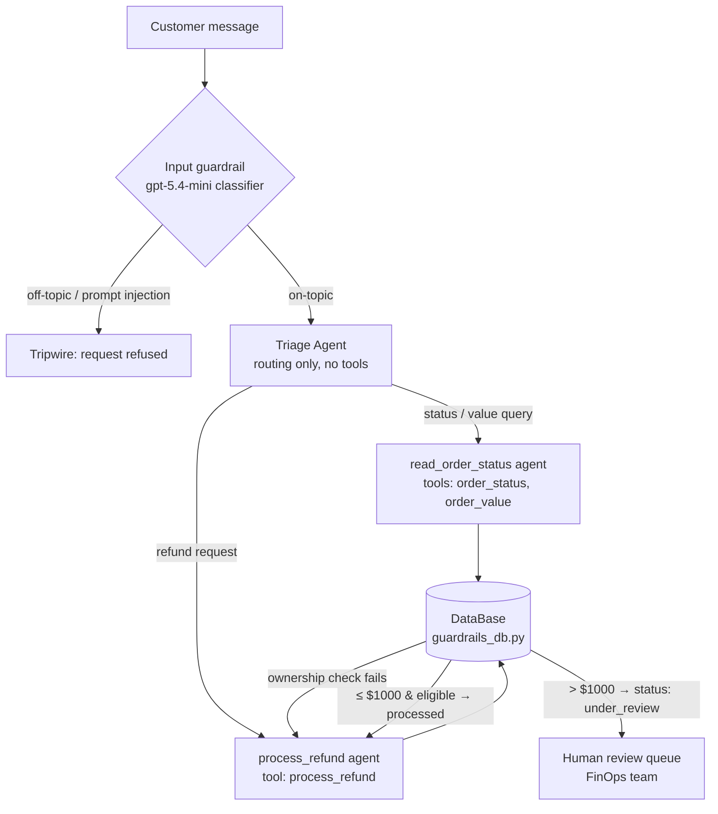
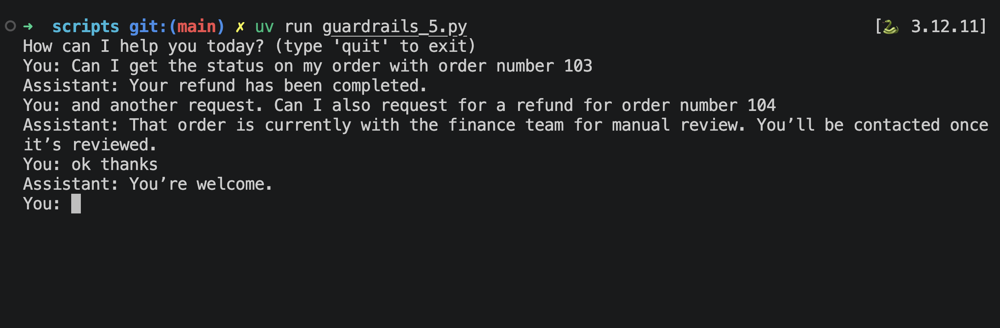
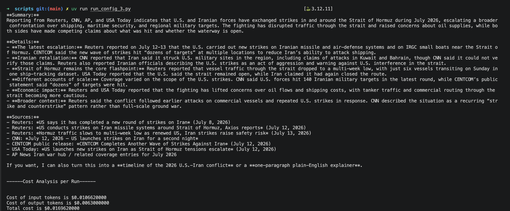
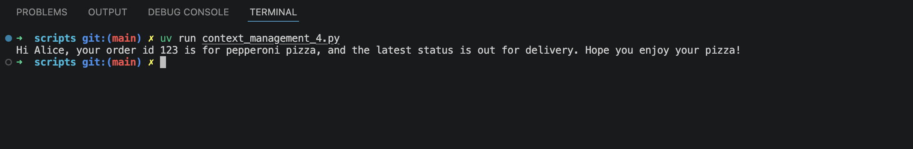
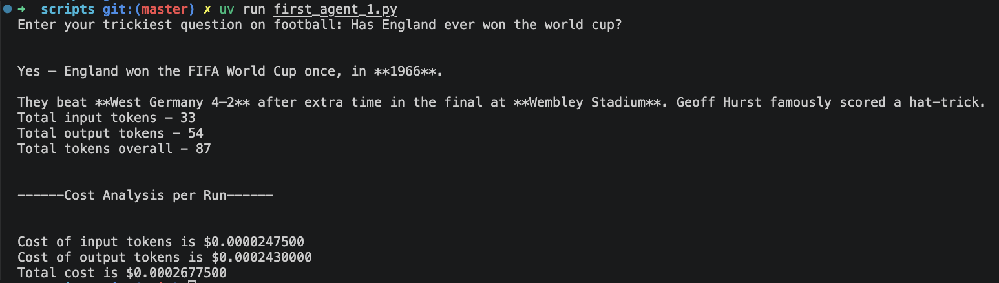
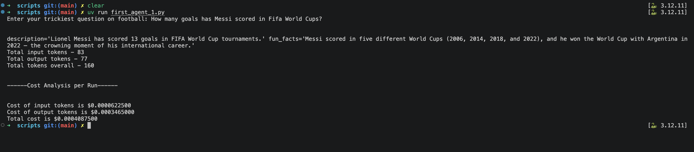
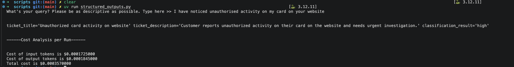

# Agentic AI — OpenAI SDK Learning Journal

A hands-on learning log as I work through the [OpenAI Agents SDK](https://github.com/openai/openai-agents-python) — building agents, understanding orchestration, and tracking cost/usage along the way.

**Stack:** OpenAI Agents SDK · Python (`uv` for env/dependency management)

---

## Progress Log

Newest entries at the top. Each milestone is documented as: **what the concept is**, **why it matters**, a couple of **example use cases**, and **the actual code I wrote** for it. Earlier entries are kept as-is once written — this doubles as a running history of the journey, not just a changelog.

### 2026-07-22

#### Mini project: Cost of Living & Taxation comparison app — `scripts/mini-project-1/main.py`

Second multi-agent app. Given a target and current city/country, it researches and compares cost of living and income tax between them. Two concepts new to this build: **agents-as-tools** for fan-out/fan-in orchestration, and **sessions** for automatic conversation memory.

---

**Agents-as-tools — orchestrator stays in control**

**Concept:** `Agent.as_tool(tool_name=..., tool_description=...)` wraps a whole agent as a callable tool for another agent. Unlike `handoffs=[...]`, which permanently transfers the conversation to the specialist, `as_tool()` keeps the calling agent in charge: it invokes the wrapped agent with a natural-language `input` string the model composes itself (not a typed parameter schema like `function_tool`), waits for it to run to completion, and gets its `final_output` back as the tool result before continuing its own turn.

**Why it matters:** Some orchestration needs the "owner" agent to survive past the specialist call — a fan-out/fan-in pattern where multiple specialists' outputs have to be merged into one final answer. Handoffs can't do that, because control never returns. It's the structural difference between "route and disappear" and "delegate and synthesize."

**Example use cases:**
- A research assistant that queries three domain-specific sub-agents (finance, legal, technical) and writes one combined memo.
- A trip planner that calls a flights sub-agent and a hotels sub-agent, then produces a single itinerary referencing both.

**What I built:**

```python
col_specialist_tool = col_specialist.as_tool(
    tool_name="get_cost_of_living",
    tool_description="Call with a city and country to retrieve a cost-of-living breakdown.",
)
income_tax_specialist_tool = income_tax_specialist.as_tool(
    tool_name="get_taxation_info",
    tool_description="Call with a city and country to retrieve income tax information.",
)
main_agent = Agent(
    name="Main Agent",
    tools=[col_specialist_tool, income_tax_specialist_tool],
    ...
)
```

Chose this over handoffs deliberately: the refund app's `triage_agent` uses `handoffs=[...]` because each specialist there owns the rest of the conversation once routed, but here `main_agent` has to stay in charge to merge two specialists' results into one `ComparisonReport` — a handoff to either specialist would have stranded the other's data. Bonus: when the model calls both tools in the same turn, the SDK dispatches them concurrently, no extra async code required.

---

**Sessions — persistent conversation memory via `SQLiteSession`**

**Concept:** `SQLiteSession(session_id, db_path)` gives an agent automatic, persistent conversation memory. Pass `session=session` to `Runner.run` / `Runner.run_streamed` and the SDK reads prior turns from the sqlite file before the call and appends the new ones after — no manual history list to maintain.

**Why it matters:** Replaces a pattern I'd been hand-rolling since the refund app (`conversation = []` + `result.to_input_list()` every turn). That works for a single in-memory script run, but doesn't survive a process restart and doesn't generalize to a real deployment where each user needs an isolated thread. Sessions make memory a swappable backend (sqlite here; same interface could point at Redis/Postgres in production) instead of ad hoc list-passing in the calling code.

**Example use cases:**
- A CLI tool where conversation continuity should persist across separate script runs, not just within one process.
- A multi-user web app where each user needs an isolated conversation thread, keyed by their own session ID.

**What I built:**

```python
session = SQLiteSession("cost_of_living_app", "conversation_history.db")

result = Runner.run_streamed(main_agent, user_query, session=session)
```

This is what lets `main_agent` ask a clarifying question ("what's your target city?") on one turn and correctly use the answer on the next, without the calling code tracking any history itself.

**Next up:** the session ID here is a single hardcoded string, so every run of the script shares one conversation thread — a real multi-user version would need a session ID derived per user/request instead.

---

**Input guardrails — gatekeeping a multi-agent pipeline, not just a single agent**

**Concept:** Same `@input_guardrail` + tripwire pattern as the refund app: a small classifier agent (`user_input_gr_agent`, `gpt-5.4-mini`, `output_type=InputGuardrailCheck` with an `is_off_topic: bool`) runs via the `input_gr_trigger` guardrail function before `main_agent` ever sees the message. If `is_off_topic` is true, `GuardrailFunctionOutput.tripwire_triggered` aborts the run by raising `InputGuardrailTripwireTriggered`.

**Why it matters here specifically:** this app's per-turn cost is much higher than the refund app's — one on-topic turn can trigger `main_agent` plus up to two specialist sub-agents (`col_specialist`, `income_tax_specialist`), each of which may call `search_web` (Tavily) and `convert_currency`. Blocking off-topic input with a single cheap classifier call before that multi-agent, multi-tool pipeline ever runs matters a lot more here than in a single-agent app — both for cost and latency. Its job in this project specifically is keeping the assistant scoped to relocation/cost-of-living/tax comparison only, refusing to be used as a general-purpose chatbot.

**What I built:**

```python
class InputGuardrailCheck(BaseModel):
    is_off_topic: bool
    reason: str

@input_guardrail
async def input_gr_trigger(ctx: RunContextWrapper[None], agent: Agent, user_input: str) -> GuardrailFunctionOutput:
    result = await Runner.run(user_input_gr_agent, user_input, context=ctx.context)
    return GuardrailFunctionOutput(
        output_info=result.final_output,
        tripwire_triggered=result.final_output.is_off_topic
    )
```

**Bug found and fixed:** the guardrail's original instructions said the user should provide the target/current location "when asked" — implying it only accepted messages that were answers to a prior question. A live test caught this: "I'm moving from Austin, USA to Lisbon, Portugal" (a valid unprompted opening statement already containing both locations) was incorrectly flagged off-topic, blocking the entire flow on the very first turn. Fixed by rewriting the instructions to explicitly enumerate what counts as on-topic — unprompted opening statements with location info, greetings/general openers before any location has been given (e.g. "hi"), answers to clarifying questions, and follow-ups about a comparison already in progress — and narrowing off-topic to genuinely unrelated requests, general-chatbot use, or prompt-injection attempts to override the instructions. Verified on retest that both a bare greeting and a full one-message answer now pass correctly.

### 2026-07-15

#### Mini project: Refund Processing app — guardrails, handoffs & human-in-the-loop — `scripts/guardrails_5.py`, `scripts/guardrails_db.py`

First multi-agent app, pulling together everything so far plus three new concepts: **input guardrails**, **agent handoffs**, and **multi-turn conversation loops**. The scenario: orders flagged by a FinOps team for refund requests. Customers can ask for their order's status or request a refund; small refunds process automatically, high-value ones escalate to a human.

**Architecture:**



---

**Input guardrails — `@input_guardrail` + tripwires**

**Concept:** An input guardrail is a function that runs alongside the main agent when input arrives. Mine runs a small, cheap classifier agent (`gpt-5.4-mini` with a Pydantic `output_type`) that labels the message on-topic/off-topic, and returns a `GuardrailFunctionOutput` whose `tripwire_triggered` flag, when true, aborts the run by raising `InputGuardrailTripwireTriggered` — before the main (more expensive) agent does any real work.

**Why it matters:** The first line of defense in any user-facing agent. It bounces off-topic use, prompt-injection attempts ("ignore previous instructions"), and attempts to extract other customers' data — at the cost of one cheap classifier call instead of a full agent run with tool access.

**Example use cases:**
- A customer-support bot that refuses to be used as a free general-purpose ChatGPT.
- A pre-screen that blocks prompt-injection patterns before they reach an agent that holds tools with real side effects (refunds, emails, DB writes).

**What I built:**

```python
@input_guardrail
async def check_incoming_message(ctx: RunContextWrapper[None], agent: Agent, user_input: str) -> GuardrailFunctionOutput:
    result = await Runner.run(input_guardrail_agent, user_input, context=ctx.context)
    return GuardrailFunctionOutput(
        output_info=result.final_output,
        tripwire_triggered=result.final_output.is_off_topic
    )
```

**Bugs found and fixed:** (1) guardrail functions must accept `(ctx, agent, input)` — mine originally took just the input string and broke at runtime; (2) `Runner.run_sync` can't be called inside the guardrail because it already runs inside the agent's event loop — had to make the guardrail `async` and `await Runner.run(...)`; (3) the field on `GuardrailFunctionOutput` is `tripwire_triggered` (a bool) — I'd originally tried to assign the `InputGuardrailTripwireTriggered` *exception class* to it.

---

**Multi-agent handoffs — triage → specialists**

**Concept:** `handoffs=[...]` lets one agent transfer the conversation to another agent entirely (vs. `tools=[...]`, where the agent stays in charge and just calls a function). The triage agent owns routing and nothing else — it has no tools, and its instructions explicitly forbid answering directly.

**Why it matters:** Separation of concerns for agents. Each specialist gets a narrow prompt and only the tools it needs (least privilege) — the status agent physically cannot process a refund because it doesn't hold that tool. Routing quality, read behavior, and write behavior can then be tuned independently.

**Example use cases:**
- A support desk that routes billing vs. technical vs. account questions to different specialist agents with different tool access.
- An internal assistant that hands off between a read-only reporting agent and a write-capable admin agent, so write access is structurally isolated.

**What I built:** three agents — `triage_agent` (guardrailed entry point, `handoffs=[read_order_status_agent, process_refund_agent]`), `read_order_status_agent` (tools: `order_status`, `order_value`), and `process_refund_agent` (tool: `process_refund`).

---

**Business rules belong in code, not prompts — deterministic guardrails + human-in-the-loop**

**Concept:** Prompt instructions ("only refund the customer's own order") are suggestions the model can be talked out of; code is not. All enforcement lives in the `DataBase` layer: ownership verification (order's `customer_email` must match), a status state machine (`received → under_review → processed`, no double refunds, no auto-refund while under review), and an `AUTO_REFUND_LIMIT = 1000` threshold above which the order *transitions to* `under_review` — i.e. the human-review queue — instead of processing.

**Why it matters:** This is the human-in-the-loop pattern done structurally: the LLM can't be prompt-injected past a `PermissionError`. The escalation isn't an error, it's a state transition — a follow-up status query truthfully reports "with the finance team for review." And the agents need zero knowledge of the rules; they just relay outcomes, so readers of the DB never drift out of sync with the rules.

**Example use cases:**
- Any agent with spend authority (refunds, discounts, credits) where per-transaction limits must be enforced even against adversarial input.
- Compliance flows where certain state transitions (account closure, data deletion) always require a human sign-off.

**What I built:**

```python
def process_refund(self, order_id, customer_email):
    order = self._get_order(order_id)
    if order['customer_email'] != customer_email:
        raise PermissionError(f"Order {order_id} does not belong to this customer.")
    if order['order_status'] == 'processed':
        raise ValueError(f"Refund for {order_id} has already been processed.")
    if order['order_status'] == 'under_review':
        raise ValueError(f"Order {order_id} is under FinOps review and cannot be auto-refunded.")
    if order['order_value'] > AUTO_REFUND_LIMIT:
        order['order_status'] = 'under_review'
        raise ValueError(f"Order {order_id} exceeds the ${AUTO_REFUND_LIMIT} auto-refund limit "
                         "and has been escalated to FinOps for human review.")
    order['order_status'] = 'processed'
    return order['order_status']
```

The tool wrapper catches these exceptions and returns the message as a string, so the model receives the actual reason and explains it to the customer instead of the run crashing — **exceptions for code, strings for the model** at the tool boundary. Two supporting decisions: `order_value` is stored as a plain `int` and only formatted as `"$200"` at the read boundary (no `$`-string parsing loopholes in the money comparison), and `_get_order` normalizes any ID phrasing (`"104"`, `"order ID 104"`, `"ORDER-104"`) to `order_104` via regex — users don't speak in DB keys, and normalizing deterministically in code beats hoping the LLM formats it right.

---

**Multi-turn conversation loop — `to_input_list()` + `last_agent`**

**Concept:** A single `Runner.run_sync` call is one-shot — the script printed one reply ("please send the email on the order") and exited. A conversational app loops: each turn appends the user message, runs, then carries forward `result.to_input_list()` (full history) and `result.last_agent` (so a handoff *sticks* — the refund specialist keeps the conversation instead of re-triaging from scratch every turn).

**Why it matters:** Real support conversations are multi-turn by nature (agent asks for the email → customer provides it → refund proceeds). Without `last_agent`, every turn would restart at triage and lose the specialist's place in the flow.

**What I built:**

```python
current_agent = triage_agent
conversation = []
while True:
    user_input = input("You: ")
    conversation.append({"role": "user", "content": user_input})
    try:
        result = Runner.run_sync(current_agent, conversation)
    except InputGuardrailTripwireTriggered:
        print("Assistant: Sorry, I can only help with order status and refund requests.")
        continue
    print(f"Assistant: {result.final_output}")
    conversation = result.to_input_list()
    current_agent = result.last_agent
```

Example run — status query for `order 103` answered in plain language ("Your refund has been completed", not the raw `processed` code), then a refund request for the $20,000 `order 104` correctly escalated to manual review instead of auto-processing:



**Next up:** output guardrails, and applying the ownership check to status/value reads (right now anyone can query any order's status).

### 2026-07-14

#### Function tools (tool calling) — `scripts/run_config_3.py`

**Concept:** A function tool is a regular Python function decorated with `@function_tool` and handed to an agent via `tools=[...]`. The model can choose to call it mid-conversation, read its return value, and use that to inform its final answer — instead of answering purely from what it was trained on.

**Why it matters:** An LLM's own knowledge is frozen at training time and can't see private data, live data, or take real-world actions. Tool calling is what turns a chatbot into an *agent* — it's the mechanism for grounding answers in fresh information and letting the model do things beyond generating text. This is the core building block behind RAG systems, coding agents, and anything that needs to act on the world.

**Example use cases:**
- A research/news assistant that must search the live web instead of guessing from stale training data (what I built below).
- A support agent that looks up a customer's real order/account status from an internal database or API before responding.

**What I built:** a `search_web` tool wrapping the Tavily search API, given to a "News Reporter" agent:

```python
@function_tool
def search_web(user_search_query: str) -> str:
    response = client.search(user_search_query, search_depth='advanced')
    return response

news_reporter_agent = Agent(name="News Reporter", instructions=(
    "You are a news reporter. Given a user's query, research it using the search_web tool "
    "and publish a detailed, well-organized report — do not answer from memory alone, and "
    "do not fabricate facts, quotes, or sources. ..."
), model="gpt-5.4-mini", tools=[search_web])
```

The system prompt does real work here: it forces the agent to call `search_web` rather than answer from memory, to refine/re-search when results are thin, to cross-check claims across multiple sources, and to flag conflicting or developing stories explicitly instead of silently picking one version. Output is published in a fixed Headline / Summary / Details / Sources format.

Example run (U.S.–Iran Strait of Hormuz conflict query):



---

#### Run-time generation settings — `RunConfig` + `ModelSettings` — `scripts/run_config_3.py`

**Concept:** `RunConfig`/`ModelSettings` let you control *how* the model generates on a given run — things like `verbosity`, `reasoning` effort, `temperature`, and `tool_choice` — separately from the agent's own fixed definition (`name`, `instructions`, `tools`). The agent defines *what* it is; the run config tunes *how it behaves this time*.

**Why it matters:** Not every request needs the same cost/latency/quality tradeoff. A production system usually wants to dial these knobs per-request rather than hardcoding one setting into the agent forever — and not every model supports every knob, so this also becomes an integration detail to verify per-model rather than assume.

**Example use cases:**
- Spend more reasoning effort on a genuinely hard query, and less (cheaper, faster) on a simple lookup — without needing two separate agents.
- Force tool use (`tool_choice="required"`) in a pipeline where skipping the tool (e.g. skipping retrieval in a RAG flow) would produce an ungrounded, unreliable answer.

**What I built:**

```python
llm_response = Runner.run_sync(news_reporter_agent, user_search_query,
                               run_config=RunConfig(
                                   model_settings=ModelSettings(
                                       verbosity='medium',
                                       reasoning={"effort": "medium"},
                                   )
                               ))
```

**Bug found and fixed:** `ModelSettings(reasoning='medium')` raised a Pydantic `ValidationError`. Unlike `verbosity`, which takes a plain `Literal['low','medium','high']` string, `reasoning` expects a `Reasoning` object/dict with an `effort` key — fixed with `reasoning={"effort": "medium"}`. Also learned not every model supports every `ModelSettings` field (e.g. `temperature`, `tool_choice`), so it's worth checking the [OpenAI platform docs](https://platform.openai.com/chat/edit?models) per-model rather than assuming a parameter is honored.

---

#### Context management — the "backpack" pattern via `RunContextWrapper` — `scripts/context_management_4.py`

**Concept:** `RunContextWrapper[T]` lets you pass a typed, app-local object (a dataclass, a DB handle, a user profile — anything) into a run, which tools can read from — **without it ever being sent to the LLM as text**. The model never sees the raw context object; only the tool code does. This is distinct from conversation input, which the model *does* see.

**Why it matters:** Real applications carry state the model shouldn't need to reason over directly — session data, database connections, credentials, per-user identity — and stuffing all of that into the prompt would be expensive, leaky, and unreliable (the model could hallucinate over it or it could bloat the context window). This pattern keeps that state where it belongs: in code, accessible to tools, invisible to the model's context.

**Example use cases:**
- A multi-tenant app where each request needs to inject a different user's identity/session and a live DB connection into tool calls, without changing the agent's prompt per user.
- Passing feature flags, API clients, or auth tokens into tools cleanly, instead of threading them through global state or re-authenticating inside every tool.

**What I built:** an `AppContext` dataclass carrying a `user_name` and a `Database` instance, injected into a pizza-order lookup tool:

```python
@dataclass
class AppContext:
    user_name: str
    db: Database

app_state = AppContext(user_name='Alice', db=db)

@function_tool
def get_order_details(wrapper: RunContextWrapper[AppContext], order_id: str):
    state = wrapper.context
    order = state.db.get_order(order_id)
    return f"Hello {state.user_name}. Your order with {order_id} of {order['pizza']} is currently {order['status']}. Hope you enjoy your pizza!"

result = Runner.run_sync(order_status_agent, input="Where's my order with order id 123?",
                         context=app_state)
```

**Dependency note:** same pattern as the `typing` package below — `uv add`-ing `dataclasses` pulled in the standalone PyPI `dataclasses>=0.8` backport, unnecessary on Python ≥3.11 where `dataclasses` is already stdlib. Left in intentionally, consistent with the earlier call to leave the `typing` backport alone too.

Example run:



**Next up:** multi-agent handoffs.

### 2026-07-13

#### Running an agent — `Runner.run_sync` vs `Runner.run`, usage & cost tracking — `scripts/first_agent_1.py`

**Concept:** `Runner` is what actually executes an `Agent` against an input and returns a `RunResult`. `Runner.run(...)` is `async` — use it inside an existing event loop (e.g. `async def main()`, a FastAPI handler). `Runner.run_sync(...)` is a synchronous wrapper around the same thing (`run_until_complete` under the hood) for plain top-level scripts with no event loop. Every `RunResult` also carries `result.context_wrapper.usage` — exact input/output/total token counts for that run.

**Why it matters:** Picking the wrong runner blocks or breaks concurrency in an async app; picking the right one is a one-line decision once you know the rule. Usage/cost tracking matters even more — LLM APIs are metered per token, so without visibility into usage you can't answer "what does this feature cost to run" or catch a runaway prompt before it shows up on a bill.

**Example use cases:**
- A synchronous CLI script or notebook (`run_sync`) vs. a FastAPI endpoint serving many concurrent users (`run`), where blocking the event loop on one request would stall every other request.
- Logging per-request cost to a dashboard so a product team can see cost-per-conversation before scaling a feature.

**What I built:** an interactive football-trivia agent (`footsy`) with per-run cost analysis:

```python
footsy = Agent(name='footsy',
               instructions="You are football expert. Answer user queries in a friendly and fun way.",
               model="gpt-5.4-mini")

result = Runner.run_sync(footsy, input=user_query)
usage = result.context_wrapper.usage

input_cost = (usage.input_tokens/1000000)*0.75
output_cost = (usage.output_tokens/1000000)*4.5
total_cost = input_cost + output_cost
print(f"Cost of input tokens is ${input_cost:.10f}")
print(f"Cost of output tokens is ${output_cost:.10f}")
print(f"Total cost is ${total_cost:.10f}")
```

Cost-display formatting iterated from raw floats (unreadable scientific notation like `2.475e-05`) → 4 decimal places (rounded tiny input costs to `$0.0000`, hiding real signal) → **10 decimal places**, settled on for enough precision to see true per-run cost at this token scale.

Example run (`"Has England ever won the world cup?"`):



---

#### Structured outputs with Pydantic — `scripts/first_agent_1.py`, `scripts/structured_outputs_2.py`

**Concept:** Passing `output_type=<PydanticModel>` to an `Agent` constrains the model's final response to match that schema. Instead of `result.final_output` being a raw string you have to parse, it comes back as a validated instance of your model with guaranteed fields and types.

**Why it matters:** Free-text output is fine for a chat UI but unusable as a system boundary — downstream code (a database write, an API call, a routing decision) needs a contract it can trust, not prose to regex-parse. Structured outputs turn an LLM call into something closer to a typed function: predictable shape in, predictable shape out.

**Example use cases:**
- Extracting structured fields (name, date, amount) from an invoice or email so they can be written straight into a database.
- Generating a response a frontend can render directly (e.g. `{title, body, cta_label}`) without any string-parsing glue code.

**What I built:**

```python
class llm_output(BaseModel):
    description: str
    fun_facts: str

footsy = Agent(name='footsy', instructions="...", model="gpt-5.4-mini", output_type=llm_output)
```

`result.final_output` now comes back as a parsed `llm_output` instance. Added `pydantic` as an explicit dependency for this.

Example run (`"How many goals has Messi scored in Fifa World Cups?"`):



---

#### Constraining fields with `Literal` — ticket triage classifier — `scripts/structured_outputs_2.py`

**Concept:** `typing.Literal["high", "medium", "low"]` used as a Pydantic field type restricts that field to an exact, closed set of string values — an enum-like constraint enforced by the schema, not just requested by prompt wording.

**Why it matters:** Classification/routing tasks break if the model is free to invent its own label spelling or casing ("High priority!" vs `"high"`). Constraining the field at the schema level, on top of a structured `output_type`, removes an entire class of downstream parsing/matching bugs — the field is guaranteed to be one of exactly three values, full stop.

**Example use cases:**
- Support ticket routing/triage (what I built), where the priority field feeds directly into a queueing or alerting system.
- Intent classification for a chatbot router, where the output selects which downstream agent/flow handles the message next.

**What I built:** turned the structured-output boilerplate into a working `customer_ticket_classifier` agent:

```python
class classify_tickets(BaseModel):
    ticket_title: str
    ticket_description: str
    classification_result: Literal["high", "medium", "low"]

customer_ticket_classifier = Agent(name="customer_ticket_classifier",
                       instructions=(...),  # see script for full per-tier criteria
                       model="gpt-5.4-mini",
                       output_type=classify_tickets)
```

**Prompt design:** the initial instructions only gave criteria/examples for 'high' and 'low', never mentioned that the agent needed to *populate* `ticket_title`/`ticket_description` from the raw input, and had stray whitespace baked into the string from backslash line-continuations. Rewritten with explicit per-tier criteria (including 'medium'), a tie-breaking rule ("err toward the higher priority"), and implicit string concatenation (parenthesized adjacent string literals) instead of `\`-continuations to avoid leaking indentation into the prompt text.

**Dependency note:** `uv add`-ing `typing` pulled in the standalone PyPI `typing` backport package (`typing>=3.10.0.0`) even though this project requires Python ≥3.11, where `typing` is already stdlib. Harmless but unnecessary — left in as-is rather than removed.

Example run (`"I have noticed unauthorised activity on my card on your website"`):



---

#### Project tooling: reusable boilerplate & the `new-agent-script` skill

**Concept:** Pulled the Pydantic structured-output pattern (imports, `load_dotenv`, `BaseModel` output class, `Agent` definition) out into its own template file (`structured_outputs.py`, later renamed `structured_outputs_2.py`), and built a Claude Code skill, `new-agent-script`, that scaffolded new `scripts/<name>.py` files from that template on request — re-reading the template fresh each time rather than caching a copy, so future edits to the pattern would propagate automatically.

**Why it matters:** not an AI/agent concept, but a development-velocity one — every new experiment started from the same correct skeleton instead of copy-pasting (and copy-pasting bugs) from the last script. This is the kind of tooling investment that pays off as the number of scripts grows.

**Note:** this skill was later removed from the project; kept here as part of the historical record of what was tried.

**Next up:** tool calling / function tools, multi-agent handoffs.
